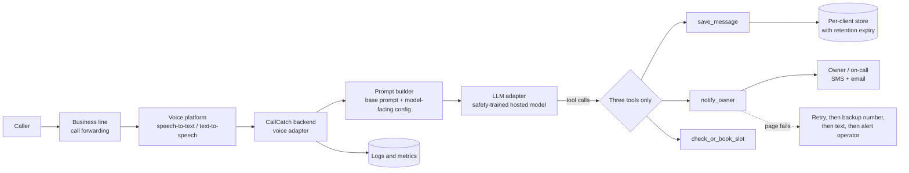
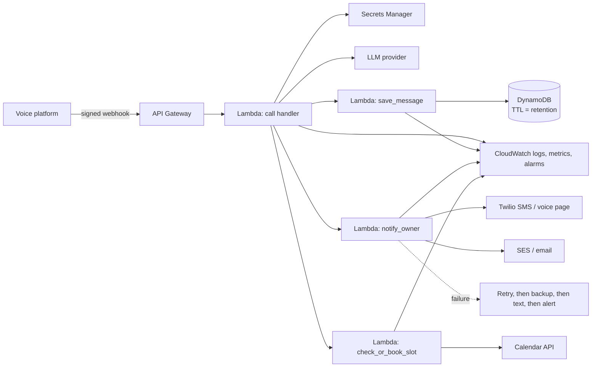

# Architecture

A short overview for contributors. What exists **today** is marked ✅. What's
**planned** is marked 🔜. The AWS deployment at the end is **optional and later**,
not part of the current design.

## The pipeline

| Stage | What happens | Status |
|---|---|---|
| Forwarding | The business line forwards calls to our agent number (`docs/call-flow.md` section 1) | Manual setup per client |
| Voice platform | Answers, streams the caller's speech as text, speaks our replies. It can play the validated greeting itself. | 🔜 **Twilio** chosen (`docs/decisions/0001-twilio-and-a2p-10dlc.md`) |
| Voice adapter | Turns platform events into conversation turns. Ends calls after the goodbye, a silence timeout, or the maximum length. | 🔜 |
| Prompt builder | `backend/prompt_builder.py`: validates the config, and inserts only `model_view()` into the base prompt | ✅ |
| LLM adapter | `backend/adapters/`: provider-neutral interface, a stub, and an Anthropic adapter | ✅ |
| Tools | `backend/tools.py`: exactly three definitions | ✅ definitions; 🔜 real implementations |
| Notifications | SMS and email to the config's numbers only. "Success" means delivery confirmed. | 🔜 |
| Store and logs | Per-client, expiring per `data.retention_days` | 🔜 |

## Adapters: why the design is vendor-neutral

Vendors change prices, policies, and quality. Each outside service sits behind a
thin **adapter**, so swapping one means writing one new file:

- **LLM:** `backend/adapters/llm_base.py` defines `LLMAdapter.respond(system_prompt, conversation, tools) -> LLMTurn`,
  using a provider-neutral conversation format. `get_llm_adapter()` picks one by `LLM_PROVIDER`.
  Nothing outside `backend/adapters/` imports a provider SDK.
- **Voice (🔜):** the same pattern: a `VoiceAdapter` that turns platform webhooks into caller turns
  and our replies into platform responses, verifies each webhook's signature
  (`VOICE_WEBHOOK_SECRET`), and reports call-ended events.
- **Notifications (🔜):** an adapter per channel (SMS, email) that returns
  `delivered` / `pending` / `failed`, where only `delivered` counts as success.

**Model requirement:** the customer-facing model is always a mainstream hosted
model with built-in safety training, never an uncensored or "abliterated" model
(`docs/safety-and-compliance.md` section 10).

## Trust boundaries

| Input | Trusted? | Where it's enforced |
|---|---|---|
| Base prompt | Yes: fixed | PR review, the drift check, the scenario runs |
| Client config | Partly: settings only, safety rules fixed | `backend/config_schema.py` (fails closed), plus `model_view()` |
| Caller speech | **No**: data, never instructions | Prompt section 9, plus tools that take no destination |
| Tool arguments from the model | **No**: they came from a caller | Backend caps length, disables links, and picks recipients from the config only |

## Where things are stored

| Data | Where | Kept |
|---|---|---|
| Client settings | `clients/<name>/config.yaml` (git, no real contacts) | Until offboarding (then archived) |
| Real contacts | `clients/<name>/private/contacts.yaml` locally; a secret store in production | Until offboarding (then destroyed) |
| Secrets | `.env` locally; a secret store in production | Rotated per `SECURITY.md` |
| Call summaries, transcripts, audio | Per-client store | `data.retention_days`, then automatic deletion |
| Logs and metrics | The logging service | TODO(me): a log retention period, with no raw transcripts in logs |

---

## Optional, later: AWS serverless deployment

> **Optional and later.** Nothing in the current design requires AWS. This
> sketch is a starting point for when we host the backend ourselves. All service
> choices are VERIFY: check features, limits, and pricing at the time.

| Piece | Role |
|---|---|
| **API Gateway** | Receives voice-platform webhooks. Signatures are checked before anything else runs. |
| **Lambda** (one function per job) | The call handler and one function per tool: small, separately permissioned. |
| **DynamoDB** | Per-client call records, keyed by client, with **TTL** (automatic expiry) set from `data.retention_days` |
| **SES / Twilio** | Email via SES. SMS and voice pages via Twilio (decision 0001), with A2P 10DLC registration treated as required. |
| **Secrets Manager** | API keys and real client contacts. Never in code or environment files. |
| **CloudWatch** | Logs, metrics, and the alarms in `docs/monitoring.md` |
| **AWS Budgets** | Spend alarms on top of the vendor spend caps |
| **Terraform, in `/infra`** | All of the above as code, reviewed by PR. Separate dev, staging, and production environments. |

**Separate IAM role per function (least privilege):**

| Function | Can do | Can't do |
|---|---|---|
| Call handler | Read its client's config and secrets; invoke the three tool functions; call the LLM | Write data directly; send messages |
| `save_message` | Write (not read or delete) to the calling client's records | Anything else |
| `notify_owner` | Send via SES/SNS; read that client's contact secret | Choose recipients from input; read call records |
| `check_or_book_slot` | Its client's calendar credentials | Delete or edit other bookings |
| Retention cleanup | DynamoDB TTL handles expiry; audio or transcript objects are deleted by a lifecycle rule | n/a |

TODO(me): decide whether and when to move to self-hosting on AWS. The voice
platform you choose may host part of this for you.
