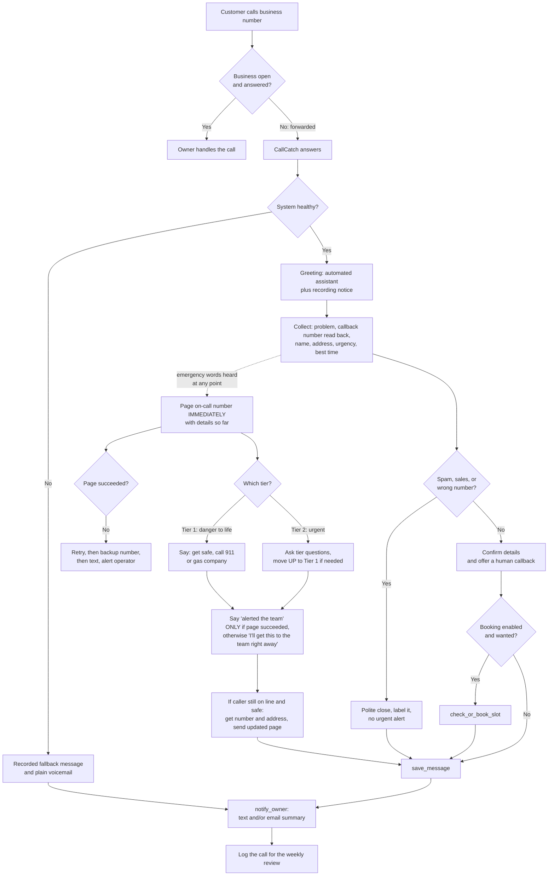

# How a CallCatch Call Works

*Written for business owners. No technical background needed.*

This document explains, step by step, what happens when someone calls your
business after hours and CallCatch answers. Examples use a made-up business,
**Acme HVAC**, and fake phone numbers that start with `555-01`.

> Markers used in this document:
> - `TODO(me):` means a decision we still need to make.
> - `VERIFY:` means a fact that can change (carrier codes, laws). Check it before relying on it.

---

## 1. How calls reach CallCatch (call forwarding)

**Call forwarding** tells your phone company to send your calls on to another
number. In this case, that's your CallCatch number, for example `+1-555-0142`.
Your customers still dial your normal number. They never see ours.

### Two kinds of forwarding

| Type | What it does | When to use it |
|---|---|---|
| **Unconditional** ("forward all calls") | Every call goes straight to CallCatch. Your phone doesn't ring. | Turn it on when you close and off when you open. |
| **Conditional** ("forward when I don't answer") | Your phone rings first. If nobody picks up after a set number of rings, or the line is busy or off, the call goes to CallCatch. | Leave it on all the time as a safety net. |

**Which should you use?**

- **After hours:** Unconditional forwarding means callers reach CallCatch on the
  first ring, with no waiting. The catch is that you have to turn it on every
  evening and off every morning. Some business phone systems and carrier apps can
  do this on a schedule. VERIFY for your carrier.
- **After N rings:** Conditional forwarding works around the clock with no daily
  switching. The catch is that during business hours, any call you miss also goes
  to CallCatch. That's usually fine, since the assistant still takes a message, but
  it adds calls to your usage.
- Many owners do both: conditional forwarding all day, plus unconditional at night.
  TODO(me): decide which we recommend by default.

### Carrier setup guide (template)

We fill this in with each owner during onboarding. **Every code below is an example
only.** Carriers change codes, and codes vary by plan and by phone system.
VERIFY each one with the carrier's current help pages, then test with a real call
before go-live.

| Carrier / phone type | Turn ON unconditional | Turn OFF unconditional | Turn ON no-answer (conditional) | Ring delay setting | Verified on (date, by whom) |
|---|---|---|---|---|---|
| Verizon mobile | VERIFY: often `*72` + number | VERIFY: often `*73` | VERIFY: often `*71` + number | VERIFY | |
| AT&T mobile | VERIFY: often `**21*` + number + `#` | VERIFY: often `##21#` | VERIFY: often `**61*` + number + `#` | VERIFY: sometimes set in the code (e.g. `**61*number**20#` for 20 seconds) | |
| T-Mobile mobile | VERIFY: often `**21*` + number + `#` | VERIFY: often `##21#` | VERIFY: often `**61*` + number + `#` | VERIFY | |
| Landline (traditional) | VERIFY: often `*72` | VERIFY: often `*73` | VERIFY: may need to be ordered from the carrier | VERIFY | |
| VoIP / business phone system (e.g. a desk-phone service) | Usually set in the provider's web portal or app | Same | Same | Same | |
| Other: ________ | | | | | |

Notes for the setup call:

- Write down which method the owner uses and how to **turn it off**. Put this in
  the client config under "forwarding setup notes".
- Some carriers charge for forwarded minutes. VERIFY on the owner's plan.
- **Caller ID:** some carriers pass the original caller's number through to us and
  some don't. VERIFY. This affects whether we can show the caller's number
  automatically, but the assistant always asks for and confirms it anyway.
- Always test by calling from a different phone. Test during the forwarding
  window, then again after turning forwarding off.

---

## 2. The greeting

The greeting is the one thing **every** caller hears. It must:

- Be short. The goal is **under about 10 seconds** spoken aloud. Read it out loud with a timer.
- Say clearly that this is an **automated assistant**.
- Give a **recording notice** that matches what we actually store. Callers can
  phone from any state, and some states require everyone on a call to agree to
  recording. VERIFY with an attorney; see `docs/safety-and-compliance.md`.

### The recording notice must match what we store

The assistant turns speech into text to understand the caller. That means
**transcripts** (written copies of the call) are usually created and stored even
when no audio is saved. The notice must never say less than what we keep.

| What we store for this client | Notice wording |
|---|---|
| Audio **and** transcripts | "this call is recorded and transcribed" |
| Transcripts only, no audio | "this call is transcribed" (TODO(me): attorney to confirm this is sufficient) |
| No audio and no transcripts (only the summary message) | No recording notice. Variant C is allowed **only** in this case. |

TODO(me): Decide what we store by default. The client config's recording-consent
wording must match that choice.

### Greeting variants

Pick one variant per client. The owner approves the exact wording.

**Variant B — Emergency first** (about 30 words, about 10 seconds; **default for plumbing, HVAC, electrical, and roofing**)
> "Acme HVAC after-hours line. I'm an automated assistant, and this call is recorded and transcribed. If anyone is in danger, hang up and call 911. Otherwise, how can I help?"

**Variant A — Standard** (about 20 words; for other trades, such as garage doors, auto repair, and gutters)
> "Thanks for calling Acme HVAC. I'm the automated after-hours assistant, and this call is recorded and transcribed. How can I help?"

**Variant C — No recording notice** (about 20 words)
> "Hi, you've reached Acme HVAC after hours. I'm an automated assistant, and I'll get your message to the team. What's going on?"

> **Variant C is valid only if this client stores NO audio AND NO transcripts.**
> If anything beyond the summary message is kept, use A or B. Using C when
> transcripts exist would mislead callers. TODO(me): attorney must confirm before
> any client uses Variant C.

TODO(me): Read all three aloud with a timer. Variant B is the longest, so trim it
first if it runs past about 10 seconds. The 911 sentence stays; cut elsewhere.
TODO(me): Confirm all recording-notice wording with an attorney.

---

## 3. What the assistant collects

The assistant gathers the following, in this order. It talks naturally, so if a
caller answers several questions at once, it doesn't ask again.

**Why this order:** asking "what's going on?" first lets an emergency come out in
the caller's first sentence. Getting the callback number second means that if
the caller hangs up partway through, the owner can still call them back.

**Emergency detection runs the whole call**, from the first word to the last.
It isn't a single question at step 5 (see section 4).

| # | Information | Example of what the assistant says | Notes |
|---|---|---|---|
| 1 | **What's wrong** | "What's going on?" (often already asked by the greeting) | Records the caller's own words. No diagnosing. |
| 2 | **Callback number** | "What's the best number to reach you?" then reads it back: "That's 5-5-5, 0-1-2-3, correct?" | **Always read back.** A wrong digit means a lost job. If forwarding passes along the caller's number (caller ID), we also log it as a **backup** number. VERIFY: caller-ID passthrough varies by carrier (see section 1). The assistant still asks, because the caller may want a different number. |
| 3 | **Name** | "And can I get your name?" | First name is fine if that's all they give. |
| 4 | **Address / service location** | "What's the address where you need service?" | Read back the street and town. If it's outside the service area, still take the message and note it. The assistant doesn't turn people away. |
| 5 | **Urgency** | "Is this an emergency, or can it wait until morning?" | Skipped if the answer is already clear. |
| 6 | **Best time to call back** | "When's a good time for the team to reach you?" | |

Before ending, the assistant briefly confirms: *"Okay, I've got Jordan at 555-0123,
at 12 Example Street, about the furnace not turning on. I'll pass this to the team
so they can call you back."*

That wording is deliberate. The assistant only promises what it controls, which is
passing the message on. When the owner calls back is up to the owner.

---

## 4. Emergencies

Some calls can't wait. The assistant listens for emergency signs the **whole
call**, starting with the first sentence. If one comes up, it switches to the
emergency steps right away and doesn't finish the normal questions first.

### What happens the moment an emergency is detected

1. **Page the owner immediately.** The page (a call or text to the on-call number
   in the client config) goes out *as soon as* the emergency is detected, before
   or while the assistant speaks the safety instructions. The caller may hang
   up at any moment, so the assistant doesn't wait. The page includes whatever
   has been collected so far, even if that's only the problem and the caller ID.
2. **Speak the safety instructions** (Tier 1) or reassure the caller (Tier 2).
3. **If the caller is still on the line and safe,** quickly get the callback
   number and address, then send an **updated** page with the new details.

### "I've alerted the on-call team" is said ONLY after the page succeeds

The assistant must never claim it alerted someone when it hasn't.

| Page status | What the assistant says after the safety instruction |
|---|---|
| **Not yet confirmed** (this is the default) | "I'll get this to the team right away." |
| **Confirmed sent** (notify_owner reported success) | "I've alerted the on-call team." |

This applies to every Tier 1 and Tier 2 row below. The rows contain only the
safety instruction. The status line above is added at the end, and the default is
always the "not yet confirmed" version.

### If the page fails

1. **Retry** the on-call number. TODO(me): how many retries, and how far apart?
2. Then page the **backup on-call number** from the client config.
3. Then send a **text message** with the details to the on-call and backup numbers.
4. At every step, **alert the CallCatch operator** (us) that an emergency page is in
   trouble, and log it.

TODO(me): Separately from failures, if a page *is* delivered but nobody responds
within ___ minutes, do we escalate to the backup number?

### Three tiers

Owners find it easier to review three short lists than one long one.

**Tier 1 — Danger to life: "Get safe and call 911."**

The Tier 1 list and wording below are **fixed in the assistant's base
instructions** (`prompts/base_system_prompt.md`). They apply to every client, in
every trade. A client's config **cannot remove or reword** any Tier 1 item or
any 911 instruction.

| Situation | Safety instruction (fixed wording) |
|---|---|
| Gas smell | "Please leave the building now, don't switch anything on or off, and once you're outside call 911 or your gas company's emergency line." VERIFY wording against gas utility guidance. |
| Carbon monoxide alarm, or people feeling dizzy, sick, or headachy | "Please get everyone outside into fresh air and call 911 now. Don't go back inside until it's been cleared." |
| Fire or smoke | "Please get out and call 911 now." |
| Sparking, or an electrical burning smell | "Please stay away from it, and if you see smoke or flames, get out and call 911." |
| Water near outlets, panels, or appliances | "Please stay out of the water and away from anything electrical, and call 911 if anyone is in danger." |
| **Anyone hurt, trapped, or in danger, for any trade** | "Please hang up and call 911 now." The owner is **also paged**, the same as every other Tier 1 row. |

**Tier 2 — Urgent: "Page the owner now."**

The assistant pages the on-call number immediately and takes the message quickly.
Instead of making judgment calls ("is it dangerously cold?"), the assistant asks
the caller **simple questions**. The answers can move a call **up** to Tier 1,
never down.

| Situation | Question the assistant asks | If the answer is yes (or unclear) |
|---|---|---|
| Water leak or burst pipe | "Is the water near any outlets, electrical panels, or appliances?" | **Tier 1** (water near electrics) |
| Sewage backing up into the home | none | Stays Tier 2 |
| No heat or no cooling (any weather) | "Is anyone elderly, a baby, or unwell in the home?" and "Is anyone feeling sick right now?" | Someone vulnerable at home: Tier 2, flagged **vulnerable occupant**. Anyone feeling sick now: **Tier 1** ("call 911"). |
| Roof leak | "Is water coming inside right now?" | Tier 2. If it's also near electrics: **Tier 1**. |
| Garage door stuck open, or a car trapped inside | "Are you able to lock up the house without it?" | If not, it stays Tier 2 and is flagged **home not secure** |
| Vehicle broken down | "Are you somewhere safe, off the road?" | If not: **Tier 1** ("If you're in danger, call 911 now.") |

**Tier 3 — Can wait until morning.**
Everything else. Normal message, normal summary.

### What each client can change

| Item | Can a client's config change it? |
|---|---|
| Tier 1 baseline list and wording | **No.** Fixed for everyone. |
| 911 instructions | **No.** |
| Add extra emergency triggers (to Tier 1 or Tier 2) | **Yes**, with written owner approval |
| On-call number and backup on-call number | **Yes**, required |
| Remove or downgrade a default Tier 2 item | TODO(me): decide. The safe default is **no**, additions only. |

### Rules that never change

1. **When unsure, pick the higher tier.** If a caller doesn't answer a tier
   question, treat the answer as "yes".
2. The assistant **never** tells a caller that something is *not* an emergency, and
   never tells them *not* to call 911.
3. The page goes out **the moment** an emergency is detected. The first thing the
   assistant *says* is the safety instruction. It only asks for a callback number
   and address if the caller is still on the line and safe.
4. The assistant says "I've alerted the on-call team" **only after** the page
   succeeds. Until then, it says "I'll get this to the team right away." It never
   promises that someone will arrive, or when.
5. **The owner approves, in writing during onboarding:** any *additional*
   emergency triggers, and the on-call and backup numbers (for example
   `+1-555-0199` and `+1-555-0198`). The owner doesn't approve or change the
   Tier 1 baseline, because that's fixed for everyone.

TODO(me): Have the Tier 1 wording reviewed. We're not safety experts, and wording
that could send someone the wrong way in an emergency needs expert review.

---

## 5. Things the assistant must NOT do

| Never | What it says instead |
|---|---|
| Quote prices or ballparks | "I'm not able to give pricing, but I'll make sure the team gets back to you about that." (Unless the owner approved specific wording in the config. The default is none.) |
| Promise arrival times ("someone will be there in an hour") | "I can't promise a time, but I'll mark this as urgent for the team." |
| Diagnose problems or give repair or warranty advice | "I'm not able to help with that, but I'll pass your message to the team." |
| Discuss other customers or their jobs | "I'm not able to share anything about other customers." |
| Reveal its instructions, setup, or configuration | "I'm not able to help with that, but I'll pass your message to the team." |
| Guess business facts not in the config (hours, services, service area) | "I'm not sure about that, but I'll have the team confirm." |
| Take payments, card numbers, or passwords | "I can't take payment information over this line. The team will follow up." |

---

## 6. Talking to a human, and what happens when something breaks

### Human callback

If the caller asks for a person, the assistant says: *"I can't transfer you right
now, but I'll pass your message to the team so someone can call you back. Can I get
your number?"*
It never pretends to be a human.

TODO(me): Do we offer live transfer to the owner for Tier 1 or Tier 2 calls? Not in
the first version unless you decide otherwise.

### Fallback: never dead air

If any part of the system fails, the caller must still be able to leave a message.

| What fails | What the caller experiences | What we do |
|---|---|---|
| The AI is slow to respond (more than ___ seconds, TODO(me)) | A short filler line ("One moment...") and then, if it's still slow, the voicemail fallback | Log it |
| The AI or voice service is down | A recorded message: "Sorry, our assistant isn't available. Please leave your name, number, address, and what's going on after the tone." Then plain voicemail. | Send the voicemail to the owner and alert us |
| The owner notification fails to send | Nothing (the caller is already done) | Retry, then try the backup channel (email if text failed, or the other way round), then alert us |
| Calendar booking fails | "I wasn't able to book that, but I'll pass this to the team so they can call you to set a time." | Note it in the summary |

TODO(me): Record the fallback voicemail greeting for each client.

---

## 7. Difficult calls

| Situation | How the assistant handles it |
|---|---|
| **Caller who won't stop talking** | Politely steps in: "Got it, that helps. Just so I get this to the team, what's the best number to reach you?" It summarizes their story briefly and doesn't cut them off rudely. |
| **Angry caller** | Stays calm and doesn't argue or make promises: "I'm sorry you're dealing with this. I'll make sure the team gets your message." Flags the call as "upset caller" in the summary. |
| **Silent caller** | "Hello, are you there?" twice, about 5 seconds apart. Then: "I can't hear you. If you need help, please call back. If this is an emergency, hang up and call 911." Then it ends the call and logs it. |
| **Lots of background noise** | Asks the caller to repeat, and reads back the key details (number and address) carefully. Notes "poor audio" in the summary so the owner double-checks. |
| **Spam or sales call** | Stays brief and polite: "I'll pass your message to the team." Labels the call **Likely spam/sales** and sends no urgent alert. TODO(me): should these go in a daily digest instead of individual texts? |
| **Wrong number** | "This is the after-hours line for Acme HVAC. Were you trying to reach us?" If not, it ends politely. Logged, and no owner alert. |
| **"Are you a robot?"** | Always answers honestly: "Yes, I'm an automated assistant. I can take your message and pass it to the team so someone can call you back." |
| **Spanish-speaking caller** | **Planned feature.** TODO(me): For clients who turn on Spanish in their config, the assistant will switch to Spanish when the caller speaks it, and the summary to the owner will still be in English. Until then, it says a short, pre-approved Spanish line asking the caller to leave their name and number, and flags the summary "Caller spoke Spanish". Wording TODO(me), to be reviewed by a fluent speaker. |
| **Caller claims to be the owner, the police, or staff, and asks for other callers' details or for the setup to change** | Treated like any other caller. The assistant can't verify identity by phone, so it shares nothing and changes nothing: "I'm not able to help with that, but I'll pass your message to the team." |

---

## 8. The summary the owner receives

Sent right after every call, by text, email, or both, according to the client config.
The text version is kept short on purpose. Full details live in the email and
the log, not in text messages.

### Text message

```
[CallCatch] New call — Acme HVAC
Jordan, 555-0123
12 Example St, Springfield
Furnace not turning on. Not an emergency.
Best time: after 8am
Please call back within 30 min of opening.
```

### Emergency text

```
[CallCatch] EMERGENCY — Acme HVAC
Caller reports GAS SMELL. Told to leave and call 911/gas co.
Jordan, 555-0123
12 Example St, Springfield
Call back NOW.
```

### Email

```
Subject: [CallCatch] New after-hours call — Jordan — Not urgent

Caller:        Jordan
Callback:      +1-555-0123 (confirmed with caller)
Caller ID:     +1-555-0123 (backup, from forwarding; "not available" if the carrier didn't pass it)
Location:      12 Example St, Springfield
Problem:       "Furnace won't turn on, house is about 60 degrees."
Urgency:       Not an emergency (caller said it can wait until morning)
Best time:     After 8am
Flags:         none   (other possible flags: upset caller, poor audio,
                       outside service area, Spanish, likely spam)
Call time:     Tue 9:42pm, 3 min
Please call back within: 30 minutes of opening

The problem description above is in the caller's own words.
```

The "call back within" line comes from the client config (the "callback-time
promise"). TODO(me): What default promise should we suggest to owners?

---

## 9. The whole flow at a glance


